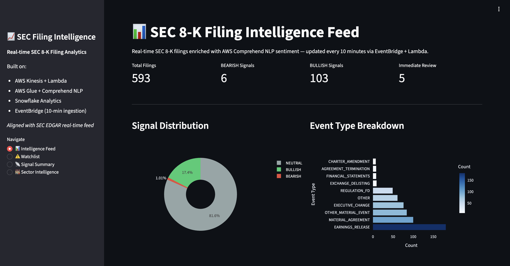
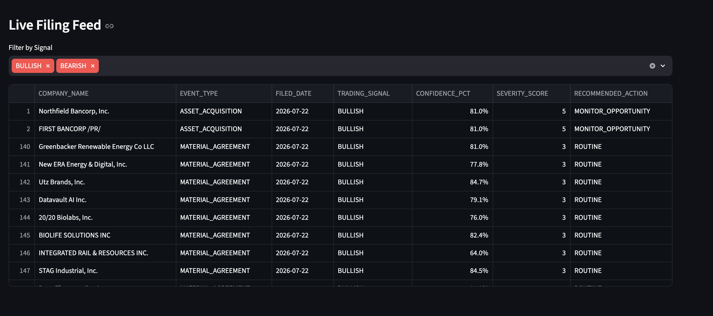
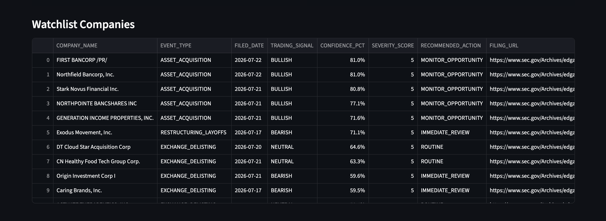
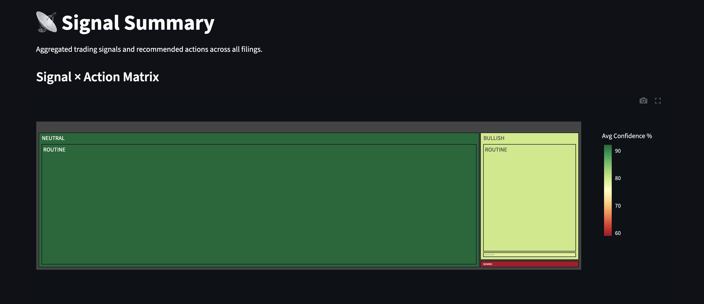
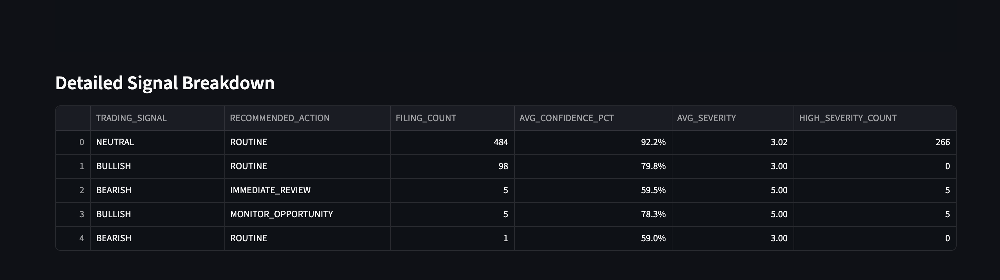
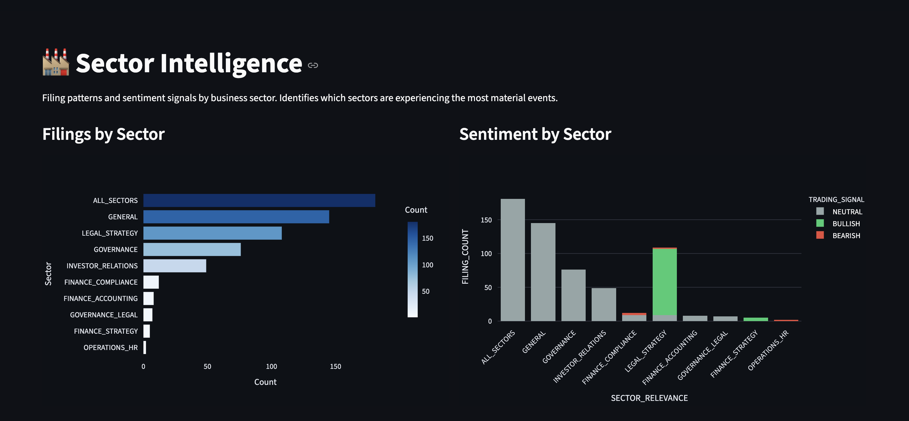

# SEC Filing Intelligence Platform

[](https://aws.amazon.com)
[](https://snowflake.com)
[](https://sec-intelligence-dashboard.onrender.com)

> Real-time SEC 8-K filing intelligence platform — ingests every corporate disclosure from EDGAR the moment it is published, classifies sentiment using AWS Comprehend NLP, and surfaces BEARISH/BULLISH/NEUTRAL trading signals across 593 real filings from 5 consecutive trading days. Equivalent capability to what Bloomberg Terminal sells for $20,000+/year, built for free.

**[Live Dashboard](https://sec-intelligence-dashboard.onrender.com)**

---

## Why this project exists

Every time a public company has a material event — earnings release, acquisition, executive departure, bankruptcy, restructuring — they are legally required to file an 8-K with the SEC within 4 business days. The SEC publishes these in real-time on EDGAR. Hedge funds, investment banks, and financial data companies like Bloomberg and AlphaSense monitor this feed and extract intelligence within seconds of publication. This project is the data engineering infrastructure behind that capability.

---

## Architecture

```
SEC EDGAR RSS Feed → free, real-time, updates every 10 minutes
         ↓
AWS EventBridge → scheduled rule every 10 minutes
         ↓
AWS Lambda
  - Fetches 8-K filings from EDGAR RSS
  - Deduplicates via DynamoDB MD5 hash lookup
  - Sends to Kinesis Data Stream
  - Saves raw JSON to S3 Bronze
         ↓
Amazon Kinesis Data Streams
         ↓
S3 Bronze Zone → raw filing JSON
         ↓
AWS Glue ETL PySpark
  - Reads Bronze JSON via wholeTextFiles
  - Maps 14 8-K item codes to event types
  - Assigns severity scores 1-5
  - Writes enriched Parquet to S3 Silver
         ↓
S3 Silver Zone → enriched structured filings
         ↓
AWS Comprehend NLP
  - Event-specific financial text templates
  - Batch classification 25 filings per API call
  - POSITIVE / NEGATIVE / NEUTRAL / MIXED + confidence score
  - Maps to BULLISH / BEARISH / NEUTRAL / WATCH trading signals
         ↓
S3 Gold Zone → sentiment-enriched signals
         ↓
Snowflake
  - External stage reading S3 Gold Parquet
  - 4 secure analytical views
         ↓
Streamlit Dashboard → live on Render
  - Filing intelligence feed with signal filters
  - Company watchlist
  - Signal summary treemap
  - Sector intelligence breakdown
```

---

## Tech Stack

| Layer | Technology | Purpose |
|---|---|---|
| Scheduling | AWS EventBridge | Triggers Lambda every 10 minutes |
| Ingestion | AWS Lambda Python | Fetches EDGAR RSS, deduplicates, routes |
| Deduplication | Amazon DynamoDB | MD5 hash tracker prevents double-ingestion |
| Streaming | Amazon Kinesis Data Streams | Decouples ingestion from processing |
| Storage | Amazon S3 | Bronze Silver Gold medallion architecture |
| ETL | AWS Glue PySpark | Event classification and enrichment |
| NLP | AWS Comprehend | Batch sentiment on financial text |
| Analytics | Snowflake | External stage on S3, 4 secure views |
| Dashboard | Streamlit on Render | Live filing intelligence feed |

---

## Key Findings (593 real filings, July 17-23 2026)

- **103 BULLISH signals** — companies entering material agreements and acquisitions
- **6 BEARISH signals** — high severity negative events flagged for immediate review
- **Goodyear Tire and Rubber** restructuring filing detected within minutes of EDGAR publication
- **4 exchange delisting notices** identified as CRITICAL severity
- **484 NEUTRAL** — routine regulatory disclosures

---

## Screenshots

### Intelligence Feed



### Watchlist — high severity BEARISH companies



### Signal Summary


### Sector Intelligence


---

## Cost

Total AWS spend to build this project: approximately $3

| Service | Cost |
|---|---|
| Lambda | Free tier |
| EventBridge | Free tier |
| Kinesis On-demand | ~$0.01 |
| DynamoDB | Free tier |
| S3 | ~$0.01 |
| Glue ETL | ~$1.50 |
| Comprehend NLP | ~$0.50 |
| Snowflake | Free trial |
| Streamlit on Render | Free tier |

---

## Repo Structure

```
SEC-Filing-Intelligence-Platform/
├── glue_jobs/
│   ├── sec_filings_etl.py       # Glue PySpark ETL Bronze to Silver
│   └── finbert_sentiment.py     # AWS Comprehend NLP Silver to Gold
├── streamlit/
│   ├── app.py                   # Streamlit dashboard
│   └── requirements.txt
├── screenshots/
├── requirements.txt
└── README.md
```

---

## Target Roles

- **Financial sector DE roles** — JPMorgan, Goldman, Capital One, Mastercard, Visa
- **Fintech platform engineering** — Robinhood, Stripe, Plaid, Bloomberg
- **Financial data companies** — S&P Global, Morningstar, FactSet, Refinitiv
- **Investment bank data platforms** — Citi, Morgan Stanley, Wells Fargo

---

## Author

**Nayan Paliwal** | MS Engineering Science Data Science, University at Buffalo

[LinkedIn](https://linkedin.com/in/nayan-paliwal) · [GitHub](https://github.com/Nayan2701)
